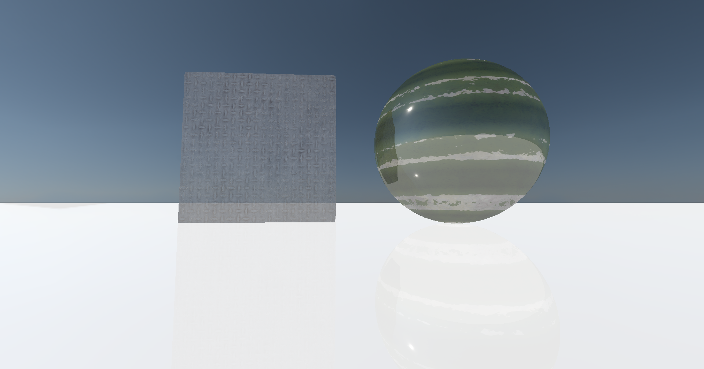

# GraphicsStudy


### DirectX 12 samples
1. Deferred Shading sample
    
    

1. Physx Simulation sample
    
    

1. Raytracing sample
    
    
    

1. Simulation sample
    
    


### Windows
##### Installing Dependencies
```
vcpkg install directxtex:x64-windows
vcpkg install directxtex[dx11]:x64-windows
vcpkg install directxtex[openexr]:x64-windows
vcpkg install directxtk12:x64-windows
vcpkg install directxtk12[xaudio2-9]:x64-windows
vcpkg install directxtk:x64-windows
vcpkg install directxtk[xaudio2-9]:x64-windows
vcpkg install fp16:x64-windows glm:x64-windows
vcpkg install imgui:x64-windows
vcpkg install imgui[dx11-binding]:x64-windows
vcpkg install imgui[dx12-binding]:x64-windows
vcpkg install imgui[win32-binding]:x64-windows
vcpkg install assimp:x64-windows
``` 
