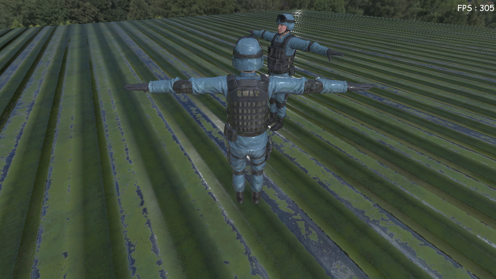
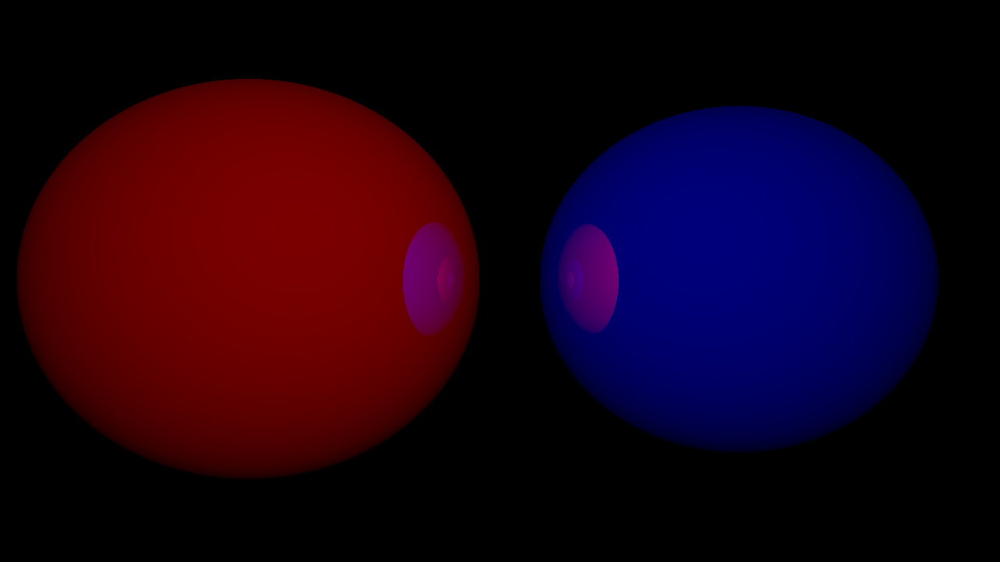

# GraphicsStudy


### DirectX 12 samples
1. Deferred Shading sample
    
    
    

1. Physx Simulation sample
    
    

1. Raytracing sample
    
    
    

1. Simulation sample
    
    
    
    


### Windows
##### Installing Dependencies
```
vcpkg install directxtex[core,dx11,openexr]:x64-windows
vcpkg install directxtk12[core,xaudio2-9]:x64-windows
vcpkg install directxtk[core,xaudio2-9]:x64-windows
vcpkg install fp16:x64-windows glm:x64-windows
vcpkg install imgui[core,dx11-binding,dx12-binding,win32-binding]:x64-windows
vcpkg install assimp:x64-windows
vcpkg install boost-serialization:x64-windows
``` 
