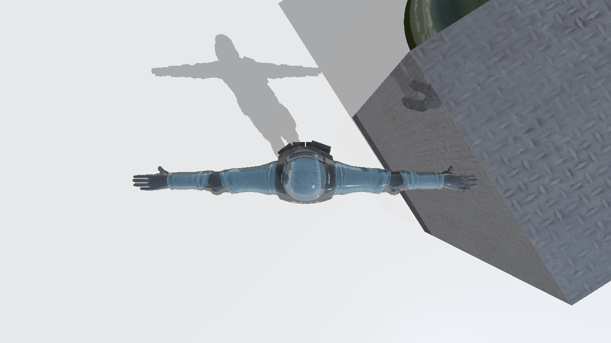

# GraphicsStudy


### DirectX 12 samples
1. Deferred Shading sample
    
    
    
    

2. Physx Simulation sample
    
    

3. Raytracing sample
    
    
    
    
    
4. Simulation sample
    
    
    
    
    
    
    
    
    

5. DLSS sample

    
    


### Windows
#### Installing Dependencies
```
vcpkg install directxtex[core,dx11,openexr]:x64-windows
vcpkg install directxtk12[core,xaudio2-9]:x64-windows
vcpkg install directxtk[core,xaudio2-9]:x64-windows
vcpkg install fp16:x64-windows glm:x64-windows
vcpkg install imgui[core,dx11-binding,dx12-binding,win32-binding]:x64-windows
vcpkg install assimp:x64-windows
vcpkg install boost-serialization:x64-windows
vcpkg install physx:x64-windows
```
#### Set Up Steam SDK

1. Visit the [Steamworks SDK Documentation](https://partner.steamgames.com/doc/sdk).
2. Download the Steam SDK from the website.
3. Once downloaded, extract the SDK files to the following path:

```
C:\Users\username\sdk
```

#### Set Up Streamline SDK

1. Visit the [Streamline SDK Github](https://github.com/NVIDIAGameWorks/Streamline).
2. Download the Streamline SDK from the website.
3. Once downloaded, extract the SDK files to the following path:

```
C:\Users\username\streamline
```
